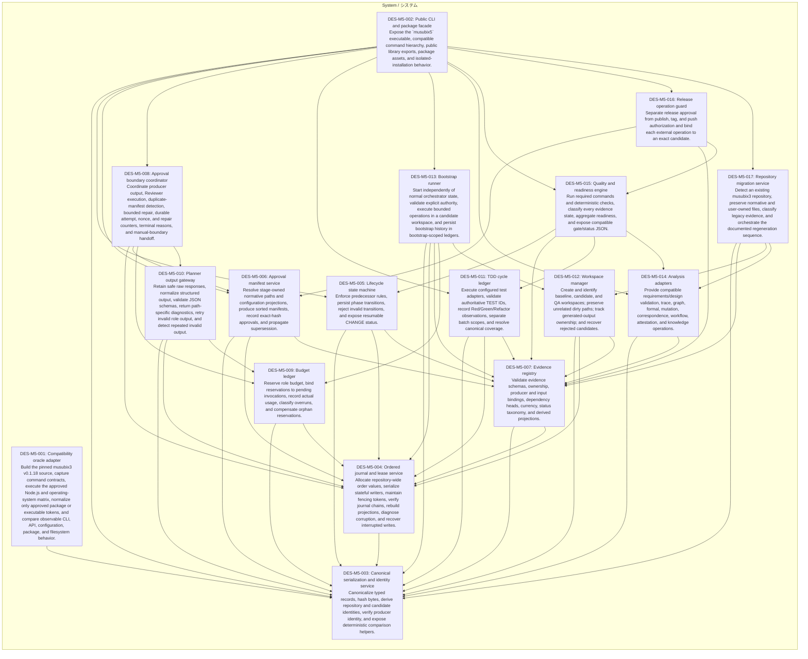

# musubix5 C4-like component diagram

```mermaid
flowchart LR
  subgraph System["System / システム"]
    DES_M5_001["DES-M5-001: Compatibility oracle adapter<br/>Build the pinned musubix3 v0.1.18 source, capture command contracts, execute the approved Node.js and operating-system matrix, normalize only approved package or executable tokens, and compare observable CLI, API, configuration, package, and filesystem behavior."]
    DES_M5_002["DES-M5-002: Public CLI and package facade<br/>Expose the `musubix5` executable, compatible command hierarchy, public library exports, package assets, and isolated-installation behavior."]
    DES_M5_003["DES-M5-003: Canonical serialization and identity service<br/>Canonicalize typed records, hash bytes, derive repository and candidate identities, verify producer identity, and expose deterministic comparison helpers."]
    DES_M5_004["DES-M5-004: Ordered journal and lease service<br/>Allocate repository-wide order values, serialize stateful writers, maintain fencing tokens, verify journal chains, rebuild projections, diagnose corruption, and recover interrupted writes."]
    DES_M5_005["DES-M5-005: Lifecycle state machine<br/>Enforce predecessor rules, persist phase transitions, reject invalid transitions, and expose resumable CHANGE status."]
    DES_M5_006["DES-M5-006: Approval manifest service<br/>Resolve stage-owned normative paths and configuration projections, produce sorted manifests, record exact-hash approvals, and propagate supersession."]
    DES_M5_007["DES-M5-007: Evidence registry<br/>Validate evidence schemas, ownership, producer and input bindings, dependency heads, currency, status taxonomy, and derived projections."]
    DES_M5_008["DES-M5-008: Approval boundary coordinator<br/>Coordinate producer output, Reviewer execution, duplicate-manifest detection, bounded repair, durable attempt, nonce, and repair counters, terminal reasons, and manual-boundary handoff."]
    DES_M5_009["DES-M5-009: Budget ledger<br/>Reserve role budget, bind reservations to pending invocations, record actual usage, classify overruns, and compensate orphan reservations."]
    DES_M5_010["DES-M5-010: Planner output gateway<br/>Retain safe raw responses, normalize structured output, validate JSON schemas, return path-specific diagnostics, retry invalid role output, and detect repeated invalid output."]
    DES_M5_011["DES-M5-011: TDD cycle ledger<br/>Execute configured test adapters, validate authoritative TEST IDs, record Red/Green/Refactor observations, separate batch scopes, and resolve canonical coverage."]
    DES_M5_012["DES-M5-012: Workspace manager<br/>Create and identify baseline, candidate, and QA workspaces; preserve unrelated dirty paths; track generated-output ownership; and recover rejected candidates."]
    DES_M5_013["DES-M5-013: Bootstrap runner<br/>Start independently of normal orchestrator state, validate explicit authority, execute bounded operations in a candidate workspace, and persist bootstrap history in bootstrap-scoped ledgers."]
    DES_M5_014["DES-M5-014: Analysis adapters<br/>Provide compatible requirements/design validation, trace, graph, formal, mutation, correspondence, workflow, attestation, and knowledge operations."]
    DES_M5_015["DES-M5-015: Quality and readiness engine<br/>Run required commands and deterministic checks, classify every evidence state, aggregate readiness, and expose compatible gate/status JSON."]
    DES_M5_016["DES-M5-016: Release operation guard<br/>Separate release approval from publish, tag, and push authorization and bind each external operation to an exact candidate."]
    DES_M5_017["DES-M5-017: Repository migration service<br/>Detect an existing musubix3 repository, preserve normative and user-owned files, classify legacy evidence, and orchestrate the documented regeneration sequence."]
  end
  DES_M5_001 --> DES_M5_003
  DES_M5_002 --> DES_M5_003
  DES_M5_002 --> DES_M5_005
  DES_M5_002 --> DES_M5_006
  DES_M5_002 --> DES_M5_008
  DES_M5_002 --> DES_M5_011
  DES_M5_002 --> DES_M5_013
  DES_M5_002 --> DES_M5_014
  DES_M5_002 --> DES_M5_015
  DES_M5_002 --> DES_M5_016
  DES_M5_002 --> DES_M5_017
  DES_M5_004 --> DES_M5_003
  DES_M5_005 --> DES_M5_003
  DES_M5_005 --> DES_M5_004
  DES_M5_005 --> DES_M5_007
  DES_M5_006 --> DES_M5_003
  DES_M5_006 --> DES_M5_004
  DES_M5_006 --> DES_M5_007
  DES_M5_007 --> DES_M5_003
  DES_M5_007 --> DES_M5_004
  DES_M5_008 --> DES_M5_004
  DES_M5_008 --> DES_M5_006
  DES_M5_008 --> DES_M5_009
  DES_M5_008 --> DES_M5_010
  DES_M5_009 --> DES_M5_003
  DES_M5_009 --> DES_M5_004
  DES_M5_010 --> DES_M5_003
  DES_M5_010 --> DES_M5_004
  DES_M5_010 --> DES_M5_009
  DES_M5_011 --> DES_M5_003
  DES_M5_011 --> DES_M5_004
  DES_M5_011 --> DES_M5_007
  DES_M5_012 --> DES_M5_003
  DES_M5_012 --> DES_M5_004
  DES_M5_012 --> DES_M5_007
  DES_M5_013 --> DES_M5_003
  DES_M5_013 --> DES_M5_004
  DES_M5_013 --> DES_M5_007
  DES_M5_013 --> DES_M5_009
  DES_M5_013 --> DES_M5_012
  DES_M5_014 --> DES_M5_003
  DES_M5_014 --> DES_M5_007
  DES_M5_015 --> DES_M5_005
  DES_M5_015 --> DES_M5_007
  DES_M5_015 --> DES_M5_011
  DES_M5_015 --> DES_M5_014
  DES_M5_016 --> DES_M5_006
  DES_M5_016 --> DES_M5_007
  DES_M5_016 --> DES_M5_015
  DES_M5_017 --> DES_M5_003
  DES_M5_017 --> DES_M5_007
  DES_M5_017 --> DES_M5_012
  DES_M5_017 --> DES_M5_014

```
