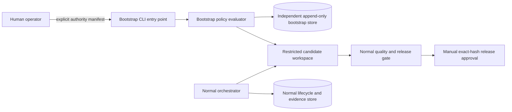

# musubix5 initial architecture and migration assessment

Status: requirements input; not approved design

## 1. Evidence basis

### Confirmed facts

- musubix3 is the compatibility baseline at tag `v0.1.18`, commit
  `c0b20f06727bceb04eeec181d95af9047b1981de`, with a clean worktree.
- musubix4 is a design reference at tag `v0.1.3`, commit
  `06f1831c228b18a12343a688faa1393fe772a6c5`, with extensive uncommitted
  source, specification, test, and generated-evidence changes.
- musubix5 is already an initialized Git repository with no commits. It
  contains untracked draft SDD files. Those files have no recorded human
  approval and are historical input only for `CHANGE-0002`.
- The existing musubix5 `CHANGE-0001` assumed that only a `musubix5`
  executable would be published. The human independently selected that policy
  for `CHANGE-0002`.
- The existing musubix5 requirements draft fails musubix3 v0.1.18 validation
  with `REQ_EARS` and `REQ_PATTERN` diagnostics. Its generated trace cache
  references missing `example` feature files and is stale.

### Primary sources

- musubix3: `package.json`, `README.md`,
  `packages/cli/src/main.ts`, `packages/domain/src`, `packages/analysis/src`,
  `tests`, `.musubix`, and release workflows.
- musubix4: `README.md`, `CHANGELOG.md`, `.musubix/hoh.json`,
  `baseline-specs/decisions`, tests, and commits `4c8b3dc` and `61af84c`.
- musubix5: current Git state and all existing `.musubix` and `docs` files.

## 2. musubix3 and musubix4 comparison

| Area | musubix3 confirmed baseline | musubix4 confirmed lesson | musubix5 proposal |
|---|---|---|---|
| CLI | Stable command tree with `--root`, `--json`, exit classes 0/1/2, and structured `CLI_ERROR` failures | Retains the core surface while adding autonomous orchestration | Contract-test every inventoried v0.1.18 command, option, default, exit class, and required JSON field |
| Package/API | Node.js >=20 ESM workspace; binary `musubix3`; exports `./domain`, `./analysis`, `./attestation` | Adds stronger archive and plugin checks | Preserve selected public exports and isolated package smoke tests; publish only `musubix5` as an intentional documented break |
| Configuration | `.musubix/config.json`, schema version 1, deterministic defaults | Adds HoH/autonomous configuration | Accept v3 schema-version-1 input unchanged; place new options in versioned extensions |
| Requirements/design | EARS Markdown, design components, ADRs, validators, C4 output | Encodes more workflow policy and autonomous boundaries | Keep normative specification immutable and separate from generated/run-local artifacts |
| Trace/graph | Trace build/check/impact and TypeScript graph index/impact/cycles/gate | Adds stronger producer/input fingerprint invalidation | Bind generated data to canonical inputs, producer identity, repository identity, and owner CHANGE |
| TDD | Structured Red/Green/Refactor evidence with authoritative TEST IDs and hash chaining | Adds successor/supersession and retry-history handling | Separate requirement batches from legacy full-set batches and select the latest complete cycle by monotonic order |
| Approval | Manual exact-manifest SHA-256 prepare/record/validate | Adds verified-auto review, producer repair, amendments, and budgets | Preserve manual exact-hash approval; redesign automated review as a bounded repair state machine |
| Workflow | Append-only workflow/change evidence and fail-closed gates | HoH introduces durable run, candidate, recovery, and isolation concerns | Use one explicit lifecycle state machine and separate normal and bootstrap state stores |
| Worktree | Repository-local operation | Records initial HEAD and dirty state; fixes candidate/recovery contamination | Use distinct baseline, candidate, and QA workspaces with explicit ownership |
| Release | Gate/status plus prepare/attest/publish scripts | Adds richer evidence heads and archive checks | Require current mandatory evidence and manual release approval; bootstrap cannot release |

## 3. Compatibility surface to preserve

The compatibility inventory will cover:

- commands and subcommands: `init`/`install`, `upgrade`, `plugin-install`,
  `requirements`, `constitution`, `design`, `trace`, `graph`, `knowledge`,
  `formal`, `gate`, `config`, `evidence`, `mutation`,
  `model-correspondence`, `workflow-record`, `workflow-verify`,
  `workflow-sanitize`, workflow waivers, `attestation`, `change-record`,
  change waivers, `approval`, `tdd`, and `status`;
- positional arguments, documented options, aliases, and defaults;
- exit code `0` for success, `1` for validation/gate failure, and `2` for
  usage or operational failure;
- JSON validation envelopes, diagnostics, trace graph fields, approval
  records, gate/status readiness fields, and structured CLI errors;
- `.musubix/config.json` schema-version-1 defaults and command configuration;
- EARS requirements validation, design validation and C4 rendering;
- trace build/check/impact, graph index/impact/cycles/gate;
- Red/Green/Refactor evidence validation and authoritative test selection;
- exact-hash approval prepare/record/validate;
- package exports `./domain`, `./analysis`, and `./attestation`;
- build, typecheck, Vitest, package archive checks, isolated installation, and
  CLI startup.

Every intentional incompatibility must have a requirement, ADR, migration
guide entry, and regression test before implementation.

The normative, version-pinned inventory is embedded in
`.musubix/features/musubix5-clean-foundation/requirements.md` so the
musubix3-compatible requirements approval manifest hashes its exact bytes.

## 4. musubix4 feature disposition

### Adopt as principles

- append-only hash-linked journals with persisted monotonic order;
- validation before any stateful write;
- explicit producer, input, repository, workspace, and CHANGE ownership;
- stale-cache rejection by canonical input and producer identity;
- isolated candidate workspaces based on a durable baseline identity;
- bounded Reviewer and repair-Planner budget reservation before consumption;
- repairable findings returned to the producer;
- narrow waivers that preserve diagnostics and cannot count as pass;
- restricted parallelism for independent read-only operations only.

### Redesign for musubix5

- manual and verified-auto approval boundaries as one explicit state machine;
- pending invocation, ordinal, nonce, reservation, actual usage, and resume
  semantics as atomic durable transitions;
- evidence-head composition through declared producer/consumer contracts;
- TDD batch identity and latest-complete-cycle selection;
- baseline/candidate/QA worktree ownership and recovery;
- Planner schema validation, retry feedback, repeated-output detection, and
  safe diagnostic retention;
- normal orchestrator and bootstrap runner as separately authorized systems.

### Do not carry forward

- any musubix4 CHANGE, approval, waiver, TDD, workflow, trace, graph, quality,
  release, benchmark, or other generated evidence;
- timestamp-based lifecycle ordering;
- writes performed before complete validation;
- baseline recomputation from a mutated candidate workspace;
- broad diagnostic suppression or treating waived/unsupported/skipped evidence
  as pass;
- release authority in bootstrap mode;
- claims that SAT/formal consistency or a configured quality gate alone proves
  behavior correctness.

## 5. Bootstrap architecture proposal



Proposed invariants:

1. Bootstrap has a separate executable entry point, state store, and authority
   manifest from normal orchestration.
2. Normal commands cannot enter bootstrap implicitly.
3. The authority manifest bounds target paths, operation classes, permissions,
   budget, iterations, and duration.
4. Every invocation, usage record, output digest, and changed byte is
   append-only and attributable to one candidate snapshot.
5. Bootstrap may produce a candidate but cannot create approval evidence,
   waive mandatory checks into pass, mark readiness true, publish, tag, or
   release.

## 6. Evidence data model proposal

All records use canonical serialization and SHA-256. `order` is allocated by
one repository-local monotonic-order service and is the chronology authority.
Wall-clock timestamps are display metadata only.

| Kind | Normative | Required identity/binding | Readiness treatment |
|---|---|---|---|
| specification | yes | artifact path, canonical digest, CHANGE | approved exact digest required |
| trace/graph | no | producer, input-set digest, repository, CHANGE, order | current pass required |
| TDD execution | no | requirement, test, command, batch scope, candidate, order | latest complete valid cycle required |
| workflow | no | invocation identity, phase, source transcript, order | current verified lifecycle required |
| approval | no | stage, sorted manifest, per-file hashes, aggregate hash, approver, order | exact current hash required |
| release | no | candidate digest, quality head, release manifest, order | current human approval required |
| benchmark | no | benchmark definition, environment, candidate, samples, order | pass only when explicitly mandatory |
| waiver | no | diagnostic code, scope, bound evidence digest, approver, expiry/order | remains waived, never pass |
| budget | no | reservation, role invocation, limit, actual usage, overrun, order | missing usage or exhausted budget blocks |
| bootstrap | no | authority manifest, operation, candidate, changes, usage, order | cannot directly satisfy release |

TDD scope identity is a tagged union:

```text
requirement-batch(changeId, requirementId, batchId)
legacy-full-set(changeId, batchId)
```

For a requirement, canonical coverage is the complete
Red -> Implementation -> Green cycle with the greatest terminal `order`.
Incomplete, voided, foreign, stale, skipped, flaky, unsupported, or superseded
cycles remain visible but are not selected.

## 7. Lifecycle state machine proposal

```text
draft-requirements
  -> requirements-valid
  -> requirements-review-clean
  -> requirements-approved
  -> design-valid
  -> design-review-clean
  -> design-approved
  -> red-recorded
  -> implementation-recorded
  -> green-recorded
  -> integrated
  -> trace-formal-complete
  -> quality-pass
  -> release-review-clean
  -> release-approved
```

Each transition:

- verifies the expected predecessor and current artifact/evidence heads;
- reserves required budget before consuming attempts, repairs, or nonces;
- persists a pending invocation before external role execution;
- commits one idempotent terminal result using the pending identity;
- allocates a unique monotonically increasing `order`;
- allocates `order` atomically across all CHANGEs, independently of
  per-CHANGE writer leases;
- fails with a classified terminal reason rather than a success-shaped result.

Verified-auto requirements/design boundary substates:

```text
producer-output
  -> schema-valid
  -> reviewer-budget-reserved
  -> reviewer-pending
  -> reviewer-accepted
     | reviewer-repairable
       -> repair-budget-reserved
       -> repair-pending
       -> producer-output
     | reviewer-rejected-terminal
```

Duplicate rejected manifest digests reuse prior findings without Reviewer
execution. Repair identity is `(boundaryKey, rejectedOutputOrdinal)`. Reservation
failure returns `budget-exhausted` without consuming attempt, repair, or nonce.
Exceeding the repair limit returns `repair-limit-exceeded`.

## 8. Confirmed musubix4 failure causes and controls

| Failure | Confirmed cause | musubix5 control |
|---|---|---|
| stale evidence | inputs or producer identity changed after evidence generation | canonical input digest and producer identity on every generated record |
| approval blocked | required evidence was not pass; workflow invocation binding was incomplete; some reviewer failures were terminal | explicit finding taxonomy, bounded repairable path, terminal reasons, no success fallback |
| dirty-worktree conflict | initial user dirt and rejected candidate output could be confused or retained in the real index/worktree | durable baseline snapshot plus separate candidate and QA workspaces |
| leaked order entries | TDD order was appended before all validation completed | validate and reserve first; append one atomic terminal record |
| stale TDD cycles | an earlier incomplete cycle could block a valid successor | deterministic latest-complete-cycle selection |

The precise historical trigger for every reported self-reference case is not
fully proven by the inspected sources. The confirmed mitigation direction is
to exclude generated outputs from their own normative inputs and declare
producer/consumer evidence heads explicitly.

## 9. Migration risks

| Risk | Severity | Mitigation |
|---|---|---|
| CLI inventory misses undocumented behavior | high | differential help, fixture, exit-code, JSON, and filesystem-effect tests against v0.1.18 |
| bootstrap becomes a release bypass | critical | separate authority/state and mandatory normal release gate |
| crash consumes counters twice | critical | durable pending invocation plus idempotent terminal commit |
| generated evidence becomes self-referential | high | immutable normative manifests and declared generated-output exclusions |
| dirty files contaminate candidates | high | baseline/candidate/QA separation and byte/mode/index identity tests |
| evidence from another CHANGE is accepted | high | mandatory owner CHANGE and repository/candidate identity |
| formal pass is overstated | high | modeled-pass/failed/unsupported/error states; unsupported receives no proof credit |
| legacy TDD batch shadows requirement evidence | high | tagged batch scope and latest complete cycle selection |
| Planner retries consume repair budget | medium | separate identities, counters, budgets, and terminal reasons |
| package-name decision breaks consumers | high | human decision before requirements approval, ADR, migration tests |

## 10. Implementation phases

1. Approve compatibility inventory and EARS requirements.
2. Approve design, ADRs, state transitions, schemas, and C4 diagrams.
3. Scaffold the TypeScript workspace and compatibility test harness.
4. Implement deterministic domain parsers and config compatibility.
5. Implement lifecycle/order/evidence storage with crash-resume tests.
6. Implement manual approval and verified-auto repair boundaries.
7. Implement budget reservation and Planner validation/retry.
8. Implement TDD evidence and deterministic cycle selection.
9. Implement worktree isolation and bootstrap runner.
10. Implement trace, graph, formal classifications, gate, and status.
11. Complete differential CLI/API/package compatibility.
12. Run full quality, release review, exact-hash release approval, and only
    then consider publish/tag/push with separate explicit human authorization.

## 11. Human decision

The human selected `musubix5-only`. The package will not expose a `musubix3`
binary alias. Requirements, design, an ADR, the migration guide, and regression
tests must treat this as an intentional compatibility break.
